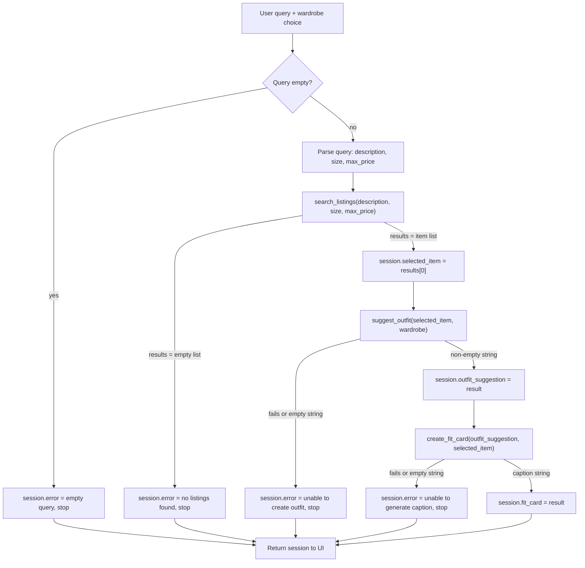

# FitFindr — planning.md

> Complete this document before writing any implementation code.
> Your spec and agent diagram are what you'll use to direct AI tools (Claude, Copilot, etc.) to generate your implementation — the more specific they are, the more useful the generated code will be.
> Your planning.md will be reviewed as part of your submission.
> Update it before starting any stretch features.

---

## Tools

List every tool your agent will use. For each tool, fill in all four fields.
You must have at least 3 tools. The three required tools are listed — add any additional tools below them.

### Tool 1: search_listings

**What it does:**
<!-- Describe what this tool does in 1–2 sentences -->
Given a user's description and the size and max price (the latter two may not be specified), search the listings data and find relevant clothing items that fit the description, size, and price criteria.

**Input parameters:**
<!-- List each parameter, its type, and what it represents -->
- `description` (str): A user's description of a clothing item they want to thrift (ex: "vintage baggy tee" or "white sneakers"). This description is required.
- `size` (str): The user's target size, which is not case sensitive (ex: "M", "m", and "S/M" would be considered the same sizes). Examples might include size tags ("S", "L", "XL", etc), size words such as "small", "medium", "large", etc, or size numbers such as waist and leg measurements. If a target size is not specified, the `size` parameter can be set to None.
- `max_price` (float): The maximum (inclusive) price that an item must remain at or below to be a relevant item. If a max price does not need to specified, `max_price` can be set to None.

**What it returns:**
Returns a list of dictionary items, where each dictionary items corresponds to one relevant clothing item. The list is returned in order of relevance, with the first item being the most relevant pick.

Each dict item in the list has the following structure:
{
    "id": str,
    "title": str,
    "description": str,
    "category": str (either "tops", "bottoms", "outerwear", "shoes", "accessories"),
    "style_tags": list[str]
    "size": str,
    "condition": str,
    "price": float,
    "colors": list[str],
    "brand": str,
    "platform": str
  },

**What happens if it fails or returns nothing:**
If the search_listings tool fails or returns an empty list, then an error message should be added to the session, stating:

"No relevant items found in the listings data for the given description, size, and price. Consider increasing the max price or add details and/or keywords to the description."

The exact wording of the error message will vary depending on if the `max_price` and `size` parameters were actually specified in the tool call arguments.


### Tool 2: suggest_outfit

**What it does:**
Given a dictionary item, `new_item` and a user's wardrobe (stored as a dict), the suggest_outfit tool returns a string description of a possible outfit, using the new_item and items from the wardrobe.

**Input parameters:**
<!-- List each parameter, its type, and what it represents -->
- `new_item` (dict): A dictionary item, as described in the output of the search_listings tool, containing information about a clothing item.
- `wardrobe` (dict): A dictionary that contains the key "items", which has a list of dict items as its value.

**What it returns:**
Returns a string description of the outfit, clearly mentioning what the components of the outfit are, by synthesizing the overall looks and styles of the different items, while naming each item. The description should also include some explanation as to why the produced outfit works well together.

**What happens if it fails or returns nothing:**
<!-- What should the agent do if the wardrobe is empty or no outfit can be suggested? -->
If the wardrobe is empty, then the returned string should be general styling advice for the selected item, rather than outright failing to produce any meaningful output.

For any other failures, an error message of "Unable to create an outfit" should be used in the session.


### Tool 3: create_fit_card

**What it does:**
<!-- Describe what this tool does in 1–2 sentences -->
Given an outfit description and the chosen new_item dict, the create_fit_card tool will return a social media caption for the outfit.

**Input parameters:**
<!-- List each parameter, its type, and what it represents -->
- `outfit` (str): The string description of the outfit, provided by the tool suggest_outfit.
- `new_item` (dict): The dict item representing the select item's listing information.

**What it returns:**
<!-- Describe the return value -->
Returns a social media-style caption (~2 to 4 sentences) of the provided outfit as a string. This caption should be somewhat creative, flow naturally, and include details such as the new item's price, name, and platform. The caption will include specific terms to capture the overall outfit, and should be different for multiple tool calls.

**What happens if it fails or returns nothing:**
If the tool fails or returns nothing, or if the provided outfit string is empty or just contains whitespace, an error message should be added for the session, such as: "Unable to generate social media caption".


### Additional Tools (if any)

<!-- Copy the block above for any tools beyond the required three -->

---

## Planning Loop

**How does your agent decide which tool to call next?**
<!-- Describe the logic your planning loop uses. What does it look at? What conditions change its behavior? How does it know when it's done? -->

Take the user's query, and check that the query is not empty. If empty, then don't continue and set the session error message to reflect that the user query is empty/invalid.

For a valid user query, have the agent use search_listings and pass the parsed description, size, and max_price from the user query (if size and/or max_price is not provided, they are set to None). The parsing can be done by an LLM.

If search_listings fails or returns an empty list, then add an error message to the session informing that no relevant items were found in the listings data, and to recommend adding more keywords or increasing the max_price, if specified.

If search_listings successfully returns a non-empty list, take the first element to be new_item. Pass the new_item and the user's wardrobe to suggest_outfit.

If suggest_outfit fails or returns an empty string, then the error message should be added to the session, saying that no outfit could be put together.

If suggest_outfit returns a successful output, pass the output and new_item to create_fit_card. If create_fit_card fails or returns an empty string, then an error message for the session should state that the caption could not be generated.

Lastly, if create_fit_card returns a successful output, then the entire session should be returned, to be displayed in the corresponding fields of the UI as outputs.

---

## State Management

**How does information from one tool get passed to the next?**
<!-- Describe how your agent stores and accesses state within a session. What data is tracked? How is it passed between tool calls? -->

The state is stored and accessed via the dictionary created by the _new_session method in agent.py.

The below is an example of an initialized session dict:
```
 return {
        "query": query,              # original user query
        "parsed": {},                # extracted description / size / max_price
        "search_results": [],        # list of matching listing dicts
        "selected_item": None,       # top result, passed into suggest_outfit
        "wardrobe": wardrobe,        # user's wardrobe dict
        "outfit_suggestion": None,   # string returned by suggest_outfit
        "fit_card": None,            # string returned by create_fit_card
        "error": None,               # set if the interaction ended early
    }
```
The query and wardrobe keys are the first to be populated, right after the user provides a query and selects a wardrobe.

The parsed field is updated by an LLM using the query string, if valid. The search_results is updated by the search_listings tool. If successful, then the first result is stored in selected_item. The outfit_suggestion field is updated when the suggest_outfit tool is used. The fit_card is updated when the create_fit_card tool is used. At any step, the error field is updated to reflect the first error that occurs in the planning loop.

---

## Error Handling

For each tool, describe the specific failure mode you're handling and what the agent does in response.

| Tool | Failure mode | Agent response |
|------|-------------|----------------|
| search_listings | No results match the query | Sets `session["error"]` to a message stating no relevant items were found, recommending the user add more keywords to the description and/or increase the max price (wording adjusts based on which filters were actually specified).  |
| suggest_outfit | Wardrobe is empty | Returns general styling advice for the new item alone, rather than a specific outfit combination. |
| create_fit_card | Outfit input is missing or incomplete |  Sets `session["error"]` to "Unable to generate social media caption" |

---

## Architecture

<!-- Draw a diagram of your agent showing how the components connect:
     User input → Planning Loop → Tools (search_listings, suggest_outfit, create_fit_card)
                                                                          ↕
                                                                   State / Session
     Show what triggers each tool, how state flows between them, and where error paths branch off.
     ASCII art, a Mermaid diagram (https://mermaid.js.org/syntax/flowchart.html), or an embedded
     sketch are all fine. You'll share this diagram with an AI tool when asking it to implement
     the planning loop and each individual tool. -->




---

## AI Tool Plan

<!-- For each part of the implementation below, describe:
     - Which AI tool you plan to use (Claude, Copilot, ChatGPT, etc.)
     - What you'll give it as input (which sections of this planning.md, your agent diagram)
     - What you expect it to produce
     - How you'll verify the output matches your spec before moving on

     "I'll use AI to help me code" is not a plan.
     "I'll give Claude my Tool 1 spec (inputs, return value, failure mode) and ask it to implement
     search_listings() using load_listings() from the data loader — then test it against 3 queries
     before trusting it" is a plan. -->

**Milestone 3 — Individual tool implementations:**
I plan to use Claude, providing the relevant Tool spec in planning.md, the architecture diagram, along with a Python function signature, and ask it to implement that tool. Additional details or context can also be manually provided. I will test each generated tool code in isolation, ensuring that it adheres with the expected output in happy path and failure cases.

**Milestone 4 — Planning loop and state management:**
I plan to use Claude, providing it my tool code, the architecture diagram (planning.md), and the error handling table (planning.md), asking it to implement the planning loop in accordance with the detailed flow. I will then test the planning loop code, paying attention to failure cases and ensuring that the intended behavior matches the actual behavior at runtime.

---

## A Complete Interaction (Step by Step)

**2-3 Sentence Description of what FitFindr does:**

FitFindr is a multi-tool agent that helps search for thrifted clothing and styling options. Given a user's query, the agent should search the listings data with the search_listings tool, select the best match if found, then take a user's wardrobe to style the selected item, and lastly generate a social media worthy description. Failure at any step, such as not finding matching items or having an incomplete outfit, should be reported to the user with a relevant explanation and/or possible next steps.

Write out what a full user interaction looks like from start to finish — tool call by tool call. Use a specific example query.

**Example user query:** "I'm looking for a vintage graphic tee under $30. I mostly wear baggy jeans and chunky sneakers. What's out there and how would I style it?"

**Step 1:**
<!-- What does the agent do first? Which tool is called? With what input? -->
An LLM should parse the user query, extracting:
- description: "vintage graphic tee"
- size: None
- max_price: 30.0

**Step 2:**
<!-- What happens next? What was returned from step 1? What tool is called now? -->
Call search_listings with the parsed parameters, description="vintage graphic tee", size=None, max_price=30.0

Output list (results) might include items with IDs lst_006 and lst_033. Suppose the first item in the list is lst_006.

Update session["selected_item"] to be results[0].

**Step 3:**
<!-- Continue until the full interaction is complete -->
Call suggest_outfit, passing the user's wardrobe and the selected_item. The resulting description might be: "Pair the selected graphic tee with the straight-leg jeans and chunky sneakers for a 90s hip and urban look".

Update session["outfit_suggestion"] to be the output of the suggest_outfit call.

**Step 4:**
Call create_fit_card, passing outfit_suggestion as the outfit parameter, and selected_item as the new_item parameter; the function returns a caption. An example might be: "Back to the 90s with this thrifted graphic tee from depop! Style and hip-hop for just 24 bucks."

Store the caption in session["fit_card"] and return the session dict.


**Final output to user:**
<!-- What does the user actually see at the end? -->
On the user's end, the UI displays the chosen item, the outfit suggestion, and the created caption for that outfit.

Ex: 
- Item: "Graphic Tee — 2003 Tour Bootleg Style for $24 ...."
- Outfit suggestion: "Pair the selected graphic tee with the straight-leg jeans and chunky sneakers for a 90s hip and urban look"
- Caption: "Back to the 90s with this thrifted graphic tee from depop! Style and hip-hop for just 24 bucks."
